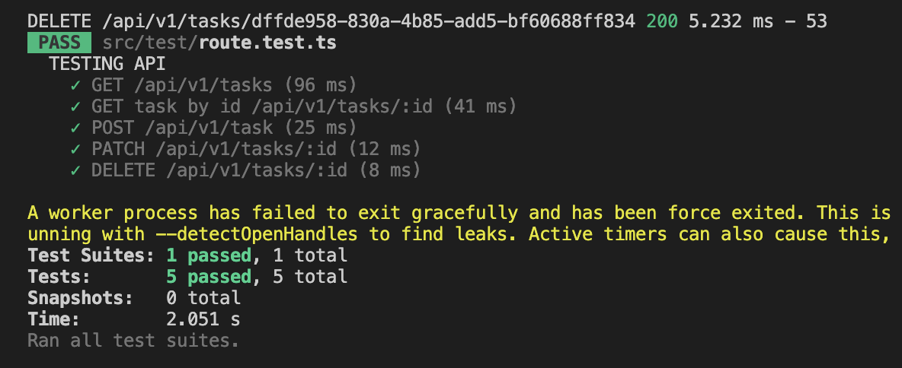

# App Express TypeScript

## Tech using

- Express
- TypeScript
- ORM Sequelize

#### For documentaion i use postman, so u can download and import to ur postman app from my folder docs, below is an example of data response

```json
{
    "status_code": 200,
    "message": "SUCCESS GET ALL DATA TASK",
    "data": [
        {
            "id": "756d8097-03b8-400b-9a9a-e83bc8aa71fb",
            "title": "TOMORROW MEET WITH CLIENT",
            "description": "Remember this important we meet tomorrow",
            "completed": false,
            "createdAt": "2023-06-26T19:10:13.000Z",
            "updatedAt": "2023-06-26T19:10:13.000Z"
        },
        {
            "id": "f71921fb-01ce-4868-b51f-c929a79f3081",
            "title": "TOMORROW MEET WITH BOSS",
            "description": "Remember this important we meet tomorrow with a big boss",
            "completed": true,
            "createdAt": "2023-06-26T19:12:19.000Z",
            "updatedAt": "2023-06-26T19:12:19.000Z"
        }
    ]
}
```

### How to run

#### REQUIRED : Before running app, fill all value in .env.example file and change this file to .env for configuration database using mysql

```env
PORT=

# CONFIG DB
DB_NAME=
DB_USER_NAME=
DB_PASSWORD=
DB_HOST=
DB_PORT=
```

how to run:

```bash
npm install
npm run db:migrate
npm run dev
```

if not created database running:

```bash
npm run db:create
```

build and run in production:

```bash
npm run build
npm run start
```

for testing routing, can run:

```bash
npm run test
```

that's below example if success running test



#### For handling error, we can monitoring from folder logs using package winston. I wrote 1 file is error.log. So we can monitoring all errors both errors from users and from internal code. This below example error in log :

```log
6/27/23, 06:06:02 GMT+7 error: BUG CONFIG DB : SequelizeConnectionError: authSwitch.authSwitchRequestMoreData is not a function 
6/27/23, 06:06:42 GMT+7 error: BUG CONFIG DB : SequelizeConnectionError: authSwitch.authSwitchRequestMoreData is not a function 
6/27/23, 06:07:20 GMT+7 error: BUG CONFIG DB : SequelizeConnectionError: authSwitch.authSwitchRequestMoreData is not a function 
6/27/23, 06:08:56 GMT+7 error: BUG INTERNAL : Error: Oops! id task not found 
6/27/23, 06:09:36 GMT+7 error: BUG INTERNAL : Error: Oops! id task not found 
6/27/23, 06:25:08 GMT+7 error: BUG INTERNAL : Error: Oops! id task not found 
6/27/23, 06:26:24 GMT+7 error: BUG INTERNAL : Error: Oops! id task not found 
6/27/23, 06:51:39 GMT+7 error: BUG INTERNAL : Error: Oops! id task not found 
6/27/23, 06:52:43 GMT+7 error: BUG INTERNAL : DELETE 400 /api/v1/tasks/756d8097-03b8-400b-9a9a-e83bc8aa71fb : Error: Oops! id task not found 
6/27/23, 06:57:06 GMT+7 error: BUG INTERNAL DELETE 404 /api/v1/tasks/756d8097-03b8-400b-9a9a-e83bc8aa71fb : Error: Oops! id task not found 
6/27/23, 07:08:17 GMT+7 error:  DELETE 404 /api/v1/tasks/756d8097-03b8-400b-9a9a-e83bc8aa71fb : Error: Oops! id task not found 
6/27/23, 07:08:37 GMT+7 error: null DELETE 404 /api/v1/tasks/756d8097-03b8-400b-9a9a-e83bc8aa71fb : Error: Oops! id task not found 
6/27/23, 07:08:57 GMT+7 error:  DELETE 404 /api/v1/tasks/756d8097-03b8-400b-9a9a-e83bc8aa71fb : Error: Oops! id task not found 
6/27/23, 07:09:46 GMT+7 error:  DELETE 404 /api/v1/tasks/756d8097-03b8-400b-9a9a-e83bc8aa71fb : Error: Oops! id task not found 
6/27/23, 07:15:08 GMT+7 error:  DELETE 404 /api/v1/tasks/756d8097-03b8-400b-9a9a-e83bc8aa71fb : Error: Oops! id task not found 
6/27/23, 07:16:28 GMT+7 error:  DELETE 404 /api/v1/tasks/756d8097-03b8-400b-9a9a-e83bc8aa71fb : Error: Oops! id task not found 
6/27/23, 07:20:12 GMT+7 error: DELETE 404 /api/v1/tasks/756d8097-03b8-400b-9a9a-e83bc8aa71fb : Error: Oops! id task not found 
6/27/23, 07:20:57 GMT+7 error: DELETE 404 /api/v1/tasks/756d8097-03b8-400b-9a9a-e83bc8aa71fb : Error: Oops! id task not found 
```
